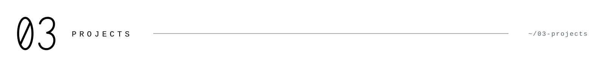
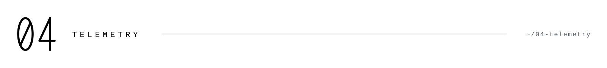
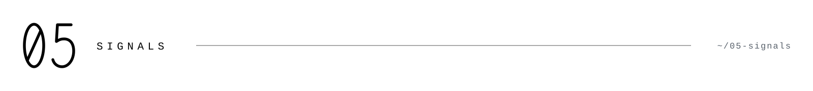
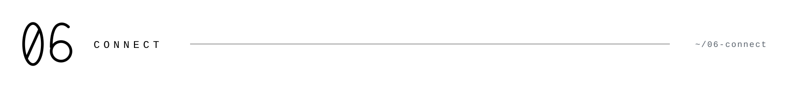

<picture><source media="(prefers-color-scheme: dark)" srcset="assets/dark/header.svg"/></picture>

<div align="center">

<a href="https://github.com/J33rry"><picture><source media="(prefers-color-scheme: dark)" srcset="https://img.shields.io/badge/GITHUB-0d1117?style=flat-square&logo=github&logoColor=ffffff"/></picture></a>
<a href="https://anil-k.vercel.app/"><picture><source media="(prefers-color-scheme: dark)" srcset="https://img.shields.io/badge/PORTFOLIO-0d1117?style=flat-square&logo=vercel&logoColor=ffffff"/></picture></a>
<a href="https://www.linkedin.com/in/j33rry/?skipRedirect=true"><picture><source media="(prefers-color-scheme: dark)" srcset="https://img.shields.io/badge/LINKEDIN-0d1117?style=flat-square&logo=linkedin&logoColor=ffffff"/></picture></a>
<a href="mailto:anilm7017@gmail.com"><picture><source media="(prefers-color-scheme: dark)" srcset="https://img.shields.io/badge/EMAIL-0d1117?style=flat-square&logo=gmail&logoColor=ffffff"/></picture></a>

</div>

<br>

<picture><source media="(prefers-color-scheme: dark)" srcset="assets/dark/s01.svg"/></picture>

Full-stack developer building for the web with **JavaScript** and **TypeScript**, with a
side interest in **machine learning**. I turn ideas into shipped code — chat apps, landing
pages, delivery platforms, and models for prediction and detection.

```
status    focusing
stack     next.js · react · node.js
exploring machine learning with python & jupyter
repos     31 public
```

<br>

<picture><source media="(prefers-color-scheme: dark)" srcset="assets/dark/s02.svg"/></picture>

<div align="center">

<picture><source media="(prefers-color-scheme: dark)" srcset="https://img.shields.io/badge/TypeScript-0d1117?style=flat-square&logo=typescript&logoColor=ffffff"/></picture>
<picture><source media="(prefers-color-scheme: dark)" srcset="https://img.shields.io/badge/JavaScript-0d1117?style=flat-square&logo=javascript&logoColor=ffffff"/></picture>
<picture><source media="(prefers-color-scheme: dark)" srcset="https://img.shields.io/badge/React-0d1117?style=flat-square&logo=react&logoColor=ffffff"/></picture>
<picture><source media="(prefers-color-scheme: dark)" srcset="https://img.shields.io/badge/Next.js-0d1117?style=flat-square&logo=nextdotjs&logoColor=ffffff"/></picture>
<picture><source media="(prefers-color-scheme: dark)" srcset="https://img.shields.io/badge/Node.js-0d1117?style=flat-square&logo=nodedotjs&logoColor=ffffff"/></picture>
<picture><source media="(prefers-color-scheme: dark)" srcset="https://img.shields.io/badge/Python-0d1117?style=flat-square&logo=python&logoColor=ffffff"/></picture>
<picture><source media="(prefers-color-scheme: dark)" srcset="https://img.shields.io/badge/Jupyter-0d1117?style=flat-square&logo=jupyter&logoColor=ffffff"/></picture>
<picture><source media="(prefers-color-scheme: dark)" srcset="https://img.shields.io/badge/HTML5-0d1117?style=flat-square&logo=html5&logoColor=ffffff"/></picture>
<picture><source media="(prefers-color-scheme: dark)" srcset="https://img.shields.io/badge/CSS3-0d1117?style=flat-square&logo=css3&logoColor=ffffff"/></picture>
<picture><source media="(prefers-color-scheme: dark)" srcset="https://img.shields.io/badge/Git-0d1117?style=flat-square&logo=git&logoColor=ffffff"/></picture>

</div>

<br>

<picture><source media="(prefers-color-scheme: dark)" srcset="assets/dark/s03.svg"/></picture>

| project | description | stack |
| --- | --- | --- |
| [`Demon-s-Bar`](https://github.com/J33rry/Demon-s-Bar) | full-stack real-time chat application | TypeScript |
| [`Cozer-Backend`](https://github.com/J33rry/Cozer-Backend) | backend service / API | JavaScript |
| [`ProFiLeR`](https://github.com/J33rry/ProFiLeR) | profile-focused web app | JavaScript |
| [`Rejoice`](https://github.com/J33rry/Rejoice) | ReJoice landing page | JavaScript |
| [`space-tour`](https://github.com/J33rry/space-tour) | your space tour guide | JavaScript |
| [`Spam-detector`](https://github.com/J33rry/Spam-detector) | ML model to detect spam messages & emails | Jupyter |

<br>

<picture><source media="(prefers-color-scheme: dark)" srcset="assets/dark/s04.svg"/></picture>

<div align="center">

<picture><source media="(prefers-color-scheme: dark)" srcset="assets/dark/stats.svg"/></picture>

<br>

<picture><source media="(prefers-color-scheme: dark)" srcset="https://github-readme-activity-graph.vercel.app/graph?username=J33rry&bg_color=0d1117&color=ffffff&line=ffffff&point=ffffff&area_color=8b949e&area=true&hide_border=true&radius=8"/></picture>

</div>

<br>

<picture><source media="(prefers-color-scheme: dark)" srcset="assets/dark/s05.svg"/></picture>

<div align="center">

<picture><source media="(prefers-color-scheme: dark)" srcset="https://img.shields.io/badge/PULL%20SHARK-0d1117?style=flat-square&logoColor=ffffff"/></picture>
<picture><source media="(prefers-color-scheme: dark)" srcset="https://img.shields.io/badge/QUICKDRAW-0d1117?style=flat-square&logoColor=ffffff"/></picture>

</div>

<br>

<picture><source media="(prefers-color-scheme: dark)" srcset="assets/dark/s06.svg"/></picture>

<div align="center">

<a href="https://github.com/J33rry"><picture><source media="(prefers-color-scheme: dark)" srcset="https://img.shields.io/badge/GITHUB-0d1117?style=flat-square&logo=github&logoColor=ffffff"/></picture></a>
<a href="https://www.linkedin.com/in/j33rry/?skipRedirect=true"><picture><source media="(prefers-color-scheme: dark)" srcset="https://img.shields.io/badge/LINKEDIN-0d1117?style=flat-square&logo=linkedin&logoColor=ffffff"/></picture></a>
<a href="mailto:anilm7017@gmail.com"><picture><source media="(prefers-color-scheme: dark)" srcset="https://img.shields.io/badge/EMAIL-0d1117?style=flat-square&logo=gmail&logoColor=ffffff"/></picture></a>

<br>
<br>

<sub><code>status: building</code></sub>

</div>

